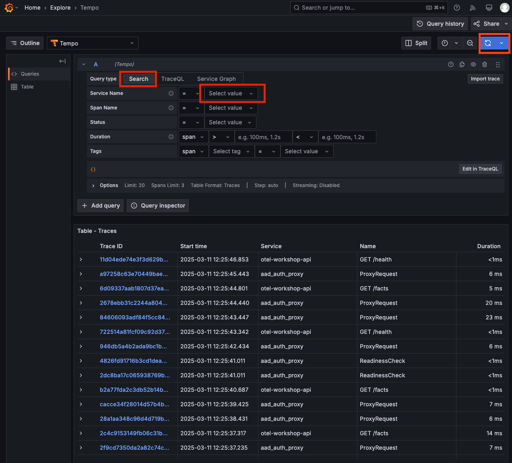

# 1 Run front-end locally and view traces in Grafana

<details>
<summary>Navigation</summary>

0. [Getting started](./000.md)
1. **Run Front End App Locally** (this task)
2. [Set up distributed tracing](./002.md)
3. [Bonus - Metrics](./003.md)

</details>

## Run and set up the app locally

When you have completed the first step you should have the app github repo cloned to your local machine and npm installed.

1. Go to the directory of the app and start it

```bash
cd otel-workshop/src/frontend
npm install
npm run dev
```

2. If all the steps above complete successfully you should now be able to review the app running at http://localhost:3000 

## Customize your app instance

In order to find the data from your app instance in Grafana you have to change the instrumentation ID of your app.

1. Open the file:

```bash
otel-workshop/src/frontend/src/otel/instrumentation.client.ts
```

Find this section (around L21)

```js
  const resource = new Resource({
    [ATTR_SERVICE_NAME]: 'otel-workshop-client',
    [ATTR_SERVICE_VERSION]: '0.1.0',
  });
```

2. Change the "ATTR_SERVICE_NAME" to any name you like

## View your app data in Grafana

1. In order to check if the trace data from your app instance is successfully sent to Grafana, go to <https://grafana.svai.dev>
2. Select Log in with Github (if your github account is connected to your SPV account you will be auto-approved, this will be the same for Frende and Bulder), if not, the presenters will approve your sign-in shortly or give you an alternative login.
3. When logged in to Grafana, press the 
 in the upper left corner and select "Explore" in the menu, make sure you are exploring `Tempo`data.
4. In the explore menu, select the "Search" tab.
5. Find your app ID in the Service Name List, select it.
6. Press the  icon in the upper right corner.
7. You should now the the traces from your instances of the application in grafana


Now you're ready to go!
Please proceed to [task 2](./002.md).
