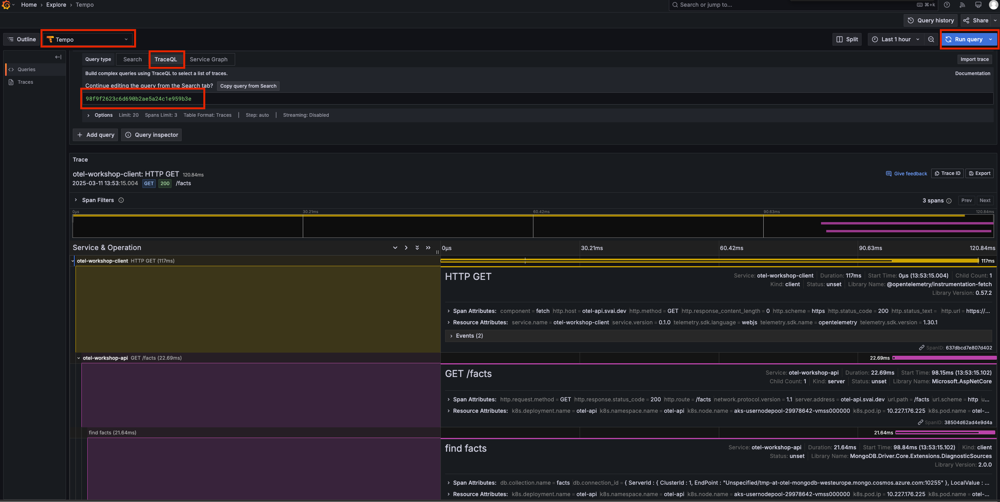

# 2 Set up distributed tracing

<details>
<summary>Navigation</summary>

0. [Getting started](./000.md)
1. [Run Front End App Locally](./001.md)
2. **Set up distributed tracing** (this task)
3. [Bonus - Metrics](./003.md)

</details>

## Edit the app to facilitate distributed tracing

In the previous step you enabled tracing from your app, which allowed you to see application traces in Grafana.
However, the traces are not connected to traces from other applications in the value chain. The point of traces is to be able to follow the request through mulitple applications, regardless of tech or stack.

1. Open the file:

```bash
otel-workshop/src/frontend/src/otel/instrumentation.client.ts
```

2. Locate this code-block

```js
 provider.register({
    contextManager: new ZoneContextManager(),
 //   propagator: new W3CTraceContextPropagator(), // Bruker W3C-propagator
  });
```

3. Remove the comment `//` from the propagator config, so that the `W3CTraceContextPropagator` is enabled
4. The `W3CTraceContextPropagator` is responsible for extracting context from incoming calls and injecting them into outging calls. Since this is a front-end client the extraction part is out of context, but the injection is very important in order to trace calls accross system boundaries.

5. Locate this code block:

```js
  registerInstrumentations({
    instrumentations: [
      new DocumentLoadInstrumentation(),
      new FetchInstrumentation({
    //   propagateTraceHeaderCorsUrls: /.*/,
        }),
        ]
  });
````

6. Remove the comment `//` so that `propagateTraceHeaderCorsUrls` is sent as a parameter for the `FetchInstrumentation`config.
7. This makes sure that trace-headers are added to all outging Fetch calls from the app to the API.
8. Restart the application and go to your [browser](http://localhost:3000), open the [Browser developer tools](https://developer.mozilla.org/en-US/docs/Learn_web_development/Howto/Tools_and_setup/What_are_browser_developer_tools)
9. Press the `View existing facts` button
10. Navigate to the `Network`tab, filter by `fetch/XHR` requests, select the `facts` request and review the `Request Headers`
11. A `Traceparent` header should now have been injected into the request.
12. Copy the first part of the value of the `Traceparent` header and store it for next step. 00-`98f9f2623c6d690b2ae5a24c1e959b3e`-637dbcd7e807d402-01 (the highlighted part)

10.

### Review your traces in Grafana

1. Go to <https://grafana.svai.dev/login>
2. Go to the explore menu, select `Tempo`, go to the `TraceQL`tab
3. Paste the value from the `Traceparent` header from the last step into the search box and press `Run query`

4. Now you should be able to see traces coming from all applications in the app value chain.
- The NextJS frontend Axpp (top)
- The Dotnet Api (middle)
- The Azure Cosmosdb (bottom)

Now you're ready to go!
Please proceed to [task 3](./003.md).
