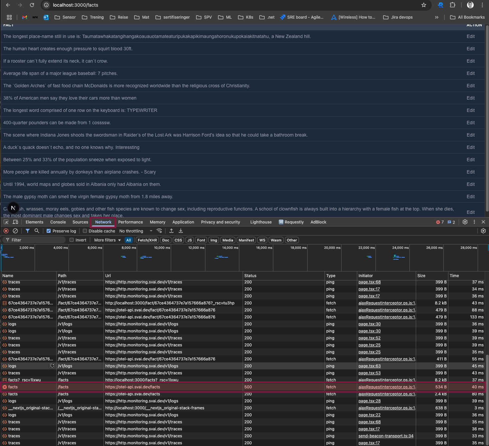
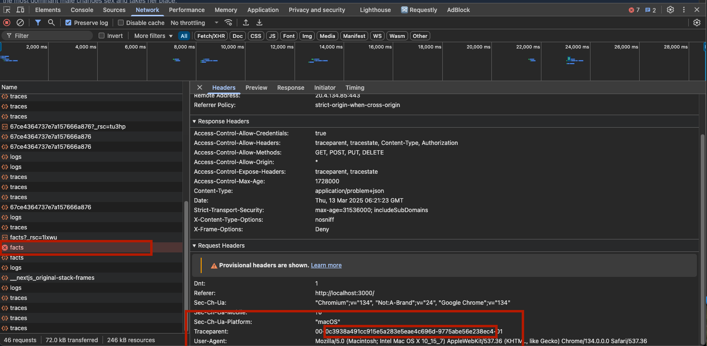
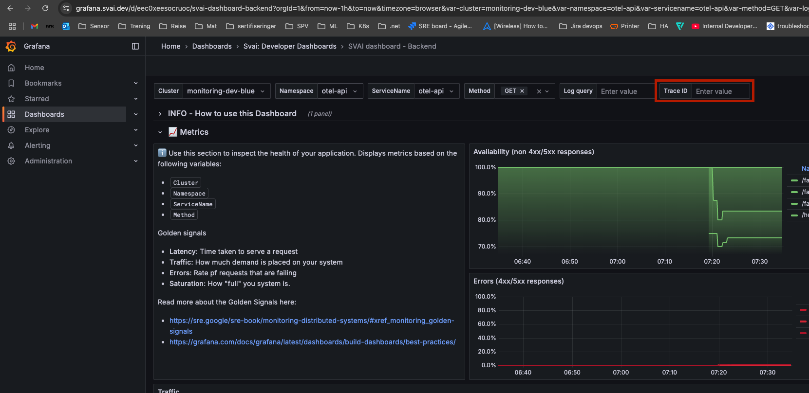

# 3 Find application error root cause

Navigation

0. ~~[Getting started](./000.md)~~
1. ~~[Run Front End App Locally](./001.md)~~
2. ~~[Set up distributed tracing](./002.md)~~
3. **Finding error root cause in the backend dashboard**(this task)
4. [Bonus - Metrics](./004.md)

## Monitor API server application with predefined Dashboard

1. Go to <https://grafana.svai.dev/login> If you not allready have opened grafana.
2. Click on the grafana logo in the top left corner.
3. Select the `Dashboards` menu. The Dashboard page will open
4. Click the `Svai: Developer Dashboards` folder.
5. Open the `SVAI dashboard - Backend` Dashboard. This dashboard consist of 4 sections. `Info`, `Metrics`, `Logs` and `Traces`. The `Info` section explaines how to use the dashboard. Additionally there is a infoblock in each other section with further details about how to use that section.
6. Choose the following variables in the top of the dasboard:

    - **Cluster**: monitoring-dev-blue
    - **Namespace**: otel-api
    - **ServiceName** otel-api
    - **Method**: GET

    leave the **Log query** and **Trace ID** empty for now.

7. Look at the different metrics and try to understand them.

### View the API logs

1. Head over to the `Logs` section in the Dasboard.
2. View the OTEL logs from the application in the `Filtered Logs` view.
3. Filter the logs based on log level by clicking the `LogLevel distribution` Cake Diagram above.
4. Remove filter by clicking the reset buttons in the `Active Filters` view.

### View the API traces

1. Find a log message of interest. Click it.
2. Scroll down and find two blue buttons: `View in Dashboard` and `View Trace in Explore`. The first button will populate the `Trace ID` dashboard variable when clicked and you will be able to view the trace in the same dashboard. The second button will open a trace query in `Explore` mode.
3. Click `View in Dashboard`. The page will reload.
4. Scroll down to the `Trace` section to view the trace.

## Find out why your app is failing in the backend dashboard

We have now enabled full logging and tracing for our application. It turns out the API was written by some very mediocre developers, leading to a very high rate of failed requests. Luckily for us we now have full insight in the application and determining the root cause of these erros should be a breeze.

1. In your application, do some browsing until you see a failed request in your developer tools network tab.

2. Click the failed request to see the headers sent for this request

3. Extract the middle part of the Traceparent Header 
4. Go to the [backend dashboard](https://grafana.svai.dev/d/eec0xeesocruoc/svai-dashboard-backend) in Grafana
5. Filter the dashboard using the Trace ID Filter. Insert the Trace ID you extracted on the previous step. See if you can find the root cause of your error.

Now you're ready to go!
Please proceed to [task 4](./004.md).
