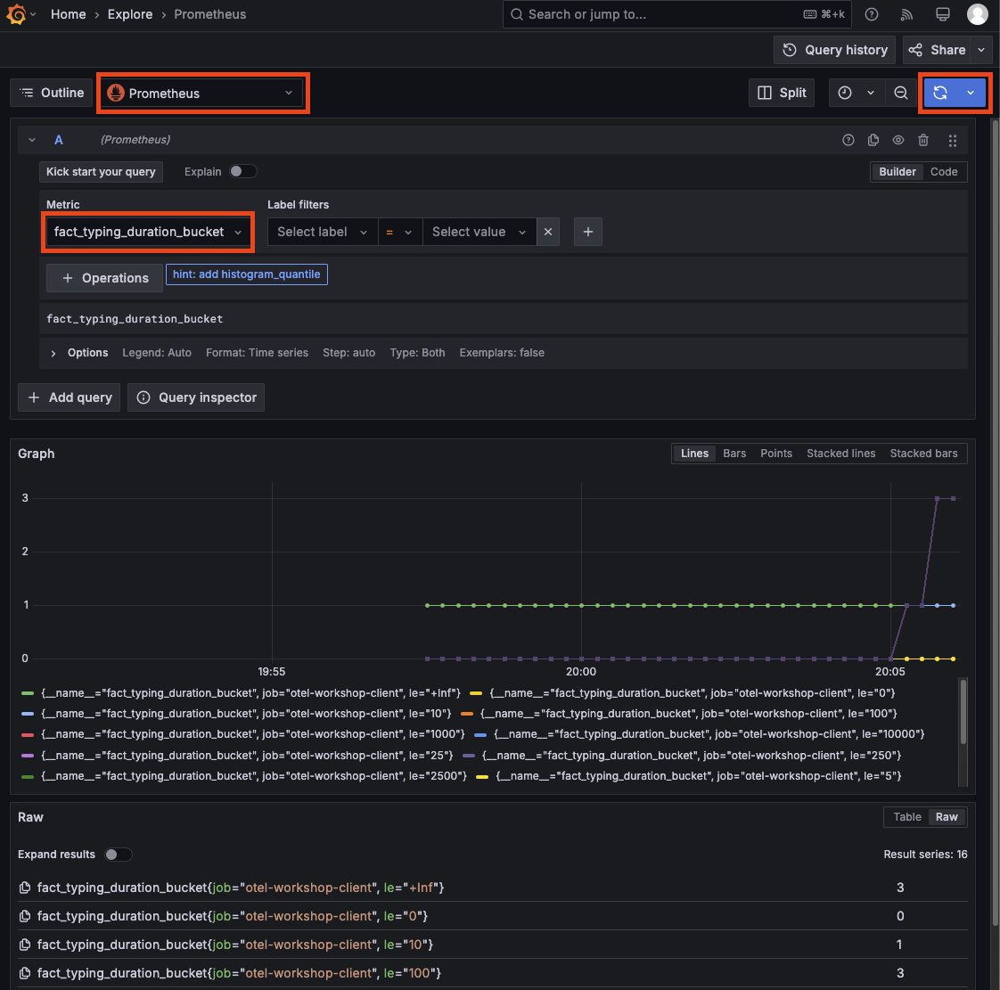

# 4 BONUS - METRICS

<details>
<summary>Navigation</summary>

0. ~~[Getting started](./000.md)~~
1. ~~[Run Front End App Locally](./001.md)~~
2. ~~[Set up distributed tracing](./002.md)~~
3. ~~[Finding error root cause in the backend dashboard](./003.md)~~
4. **Bonus - Metrics** (this task)

</details>

## Create your own metric and explore it in grafana

1. In the code you can find different metric counters, here are some examples

```bash
src/frontend/src/app/fact/page.tsx
```

```js
  const typingDuration = meter.createHistogram('fact.typing.duration', {
    description: 'Time spent typing a fact',
  });
```

```bash
src/frontend/src/app/page.tsx
```

```js
    const emojiCounter = meter.createCounter('emoji.count.total', {
      description: 'Total number of emojis displayed',
    });
```

2. The OTEL Metrics API meter operations support multiple types of metrics/operations [link](https://opentelemetry.io/docs/specs/otel/metrics/api/#meter-operations)
3. Create your own metric in the app that measures something you want to measure.
4. When you have added the required code in the app, go to [Grafana](https://grafana.svai.dev)
5. Go to the Explore menu, but this time select `Prometheus`as your data source, look for your metric name in the metric explorer dropdown.
6. After you have selected your metric name, press the  icon in the upper right corner


You are all done now! Go fix your apps!
